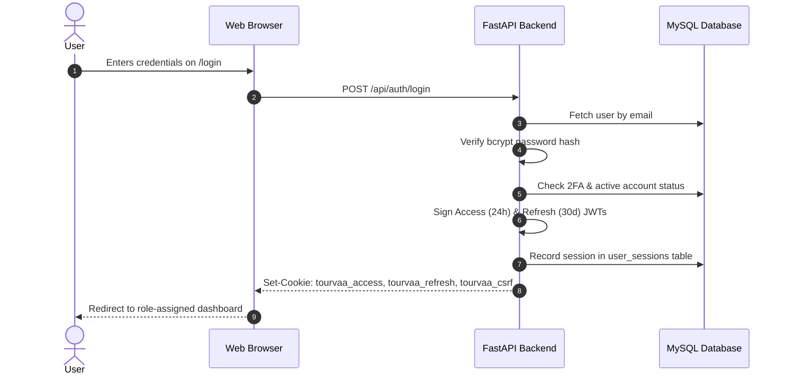

# Authentication & Authorization Sequence Diagram

```mermaid
sequenceDiagram
    autonumber
    actor User as User
    participant Browser as Web Browser
    participant API as FastAPI Backend
    participant DB as MySQL Database

    User->>Browser: Enters credentials on /login
    Browser->>API: POST /api/auth/login
    API->>DB: Fetch user by email
    API->>API: Verify bcrypt password hash
    API->>DB: Check 2FA & active account status
    API->>API: Sign Access (24h) & Refresh (30d) JWTs
    API->>DB: Record session in user_sessions table
    API-->>Browser: Set-Cookie: tourvaa_access, tourvaa_refresh, tourvaa_csrf
    Browser-->>User: Redirect to role-assigned dashboard
```
