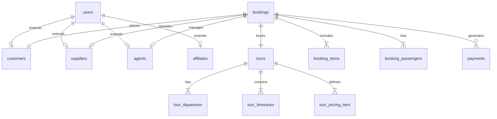

# Core Database Entity-Relationship Diagram (ERD)

```mermaid
erDiagram
    users ||--o| customers : extends
    users ||--o| suppliers : extends
    users ||--o| agents : extends
    users ||--o| affiliates : extends

    tours ||--|{ tour_departures : has
    tours ||--|{ tour_itineraries : contains
    tours ||--|{ tour_pricing_tiers : defines

    bookings ||--|| tours : books
    bookings ||--|| customers : places
    bookings ||--o| agents : manages
    bookings ||--o| suppliers : operates
    bookings ||--|{ booking_items : includes
    bookings ||--|{ booking_passengers : lists
    bookings ||--o{ payments : generates
```
