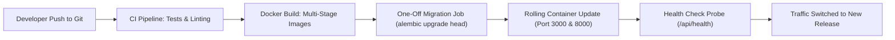

# Production Deployment Flow Diagram

```mermaid
flowchart LR
    DEV["Developer Push to Git"] --> CI["CI Pipeline: Tests & Linting"]
    CI --> BUILD["Docker Build: Multi-Stage Images"]
    BUILD --> MIGRATE["One-Off Migration Job (alembic upgrade head)"]
    MIGRATE --> DEPLOY["Rolling Container Update (Port 3000 & 8000)"]
    DEPLOY --> HEALTH["Health Check Probe (/api/health)"]
    HEALTH --> LIVE["Traffic Switched to New Release"]
```
