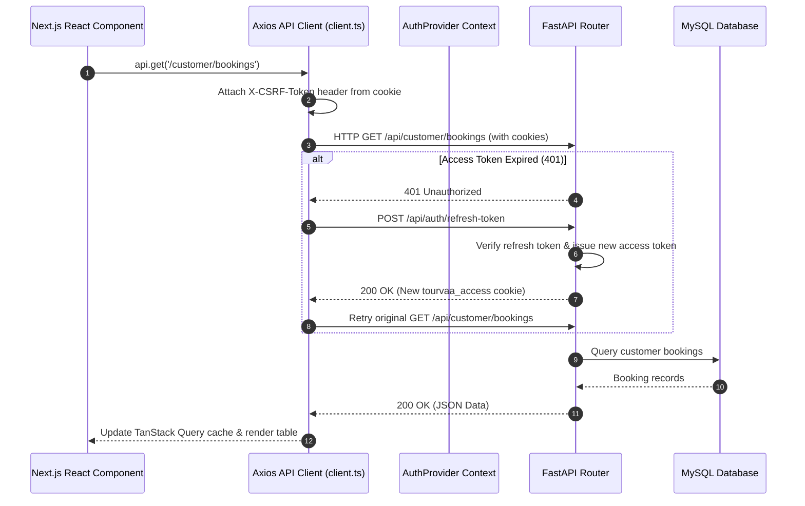

# Frontend-to-Backend Request Flow Diagram

```mermaid
sequenceDiagram
    autonumber
    participant UI as Next.js React Component
    participant Client as Axios API Client (client.ts)
    participant Auth as AuthProvider Context
    participant API as FastAPI Router
    participant DB as MySQL Database

    UI->>Client: api.get('/customer/bookings')
    Client->>Client: Attach X-CSRF-Token header from cookie
    Client->>API: HTTP GET /api/customer/bookings (with cookies)
    alt Access Token Expired (401)
        API-->>Client: 401 Unauthorized
        Client->>API: POST /api/auth/refresh-token
        API->>API: Verify refresh token & issue new access token
        API-->>Client: 200 OK (New tourvaa_access cookie)
        Client->>API: Retry original GET /api/customer/bookings
    end
    API->>DB: Query customer bookings
    DB-->>API: Booking records
    API-->>Client: 200 OK (JSON Data)
    Client-->>UI: Update TanStack Query cache & render table
```
