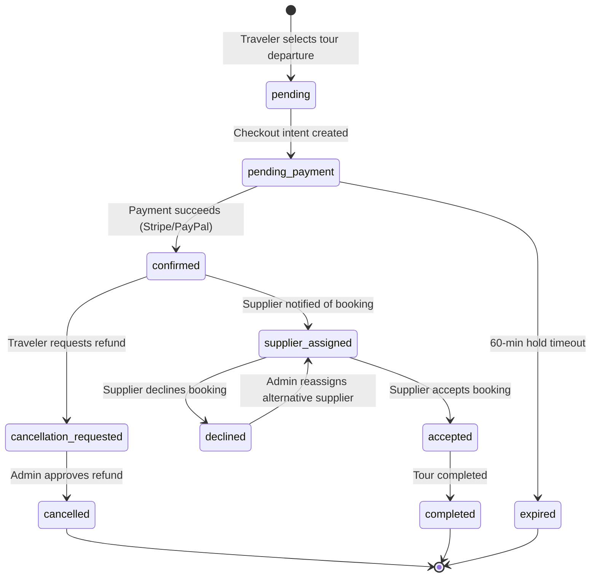

# End-to-End Booking & Supplier Workflow Diagram

```mermaid
stateDiagram-v2
    [*] --> pending: Traveler selects tour departure
    pending --> pending_payment: Checkout intent created
    pending_payment --> confirmed: Payment succeeds (Stripe/PayPal)
    pending_payment --> expired: 60-min hold timeout
    confirmed --> supplier_assigned: Supplier notified of booking
    supplier_assigned --> accepted: Supplier accepts booking
    supplier_assigned --> declined: Supplier declines booking
    declined --> supplier_assigned: Admin reassigns alternative supplier
    accepted --> completed: Tour completed
    confirmed --> cancellation_requested: Traveler requests refund
    cancellation_requested --> cancelled: Admin approves refund
    cancelled --> [*]
    completed --> [*]
    expired --> [*]
```
