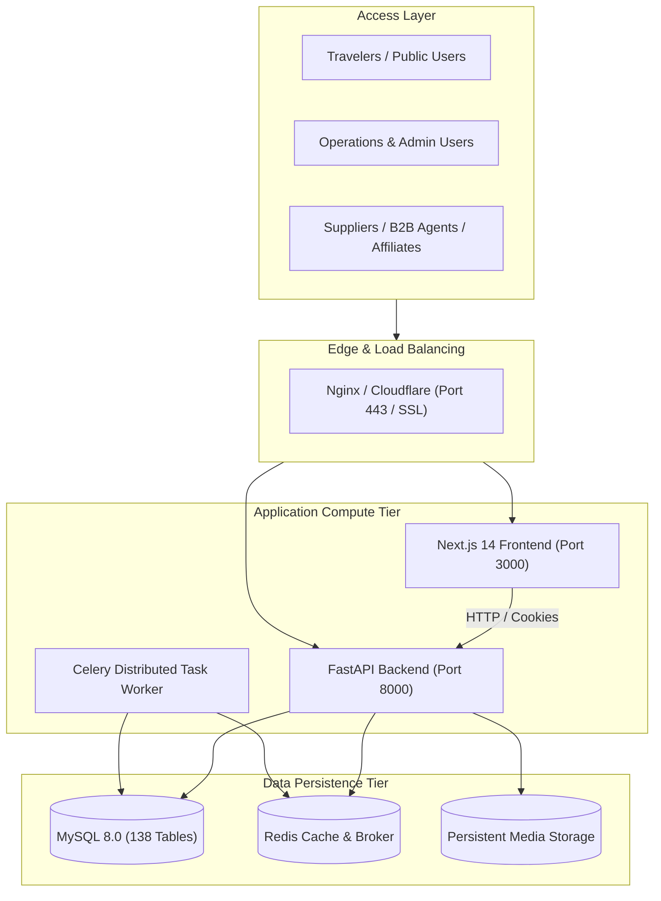

# System Overview Architecture Diagram

```mermaid
flowchart TD
    subgraph Clients["Access Layer"]
        TRAV["Travelers / Public Users"]
        OPS["Operations & Admin Users"]
        PARTNERS["Suppliers / B2B Agents / Affiliates"]
    end

    subgraph Edge["Edge & Load Balancing"]
        NGINX["Nginx / Cloudflare (Port 443 / SSL)"]
    end

    subgraph AppTier["Application Compute Tier"]
        FE["Next.js 14 Frontend (Port 3000)"]
        BE["FastAPI Backend (Port 8000)"]
        CELERY["Celery Distributed Task Worker"]
    end

    subgraph DataTier["Data Persistence Tier"]
        MYSQL[("MySQL 8.0 (138 Tables)")]
        REDIS[("Redis Cache & Broker")]
        STORAGE[("Persistent Media Storage")]
    end

    Clients --> Edge
    Edge --> FE
    Edge --> BE
    FE -->|HTTP / Cookies| BE
    BE --> MYSQL
    BE --> REDIS
    CELERY --> REDIS
    CELERY --> MYSQL
    BE --> STORAGE
```
